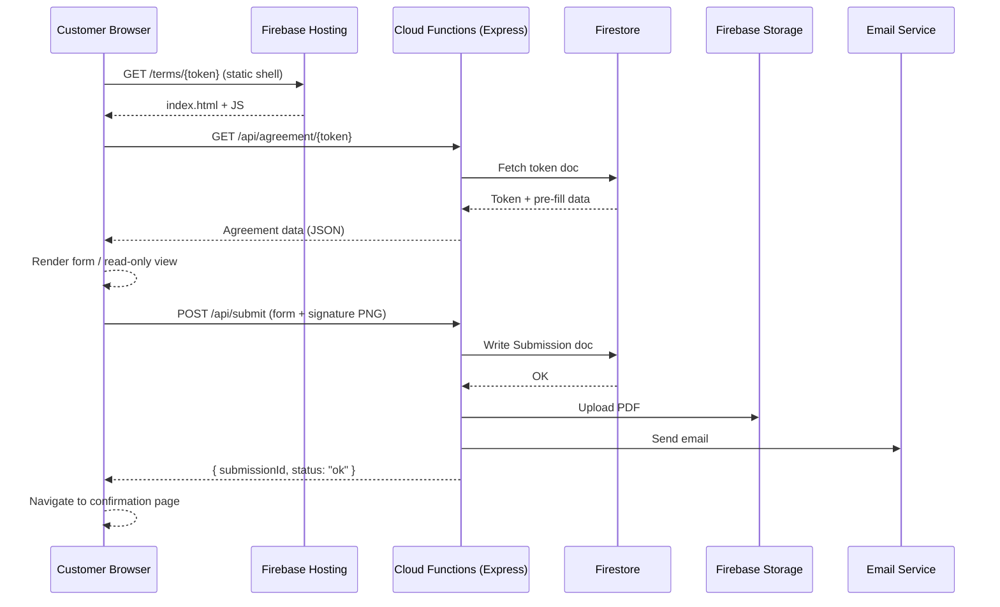
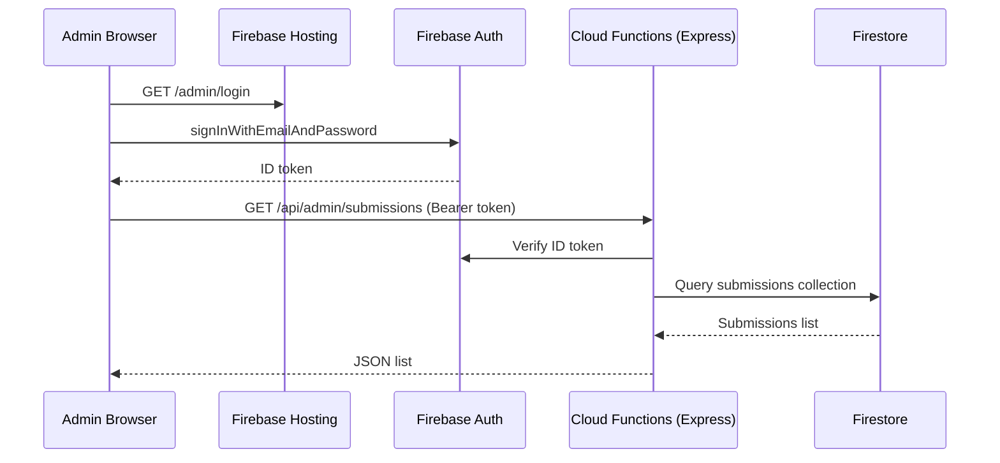

# Design Document — Great Comfort Agreement

## Overview

The Great Comfort Agreement application is a full-stack web application that digitises the Transportation Terms & Conditions signing workflow for Great Comfort Services. A staff member generates a unique token-based link for a customer; the customer follows the link, reviews the terms, fills in passenger/trip details, draws an electronic signature, and submits. The system persists the submission in Firestore, generates a PDF, stores it in Firebase Storage, and emails the staff. An admin dashboard lets authorised staff browse and inspect all submissions.

### Key Design Goals

- **Security**: Each agreement is gated behind a single-use cryptographic token; Firestore security rules enforce ownership and immutability; all traffic is over HTTPS.
- **Simplicity**: Vanilla HTML/CSS/JS for the frontend avoids build-tooling complexity and keeps the codebase small and auditable.
- **Reliability**: PDF generation and email dispatch are asynchronous post-submission tasks; a failure in either does not prevent the customer from receiving a confirmation.
- **Auditability**: Submissions are write-once; only the Firebase Admin SDK may update or delete records.

---

## Architecture

### High-Level Components

```
Customer Browser                Admin Browser
      |                               |
      |  HTTPS                        |  HTTPS
      v                               v
Firebase Hosting (Static Assets — HTML/CSS/JS)
      |                               |
      | Fetch / XHR                   | Fetch / XHR
      v                               v
Firebase Cloud Functions (Node.js + Express)
      |            |           |            |
      v            v           v            v
Firestore     Firebase      PDFKit      SendGrid /
 (data)       Storage       (PDF)       Nodemailer
              (PDFs)                    (email)
```

### Request Flow — Customer Signing



### Request Flow — Admin Dashboard



---

## Components and Interfaces

### 1. Static Frontend (Firebase Hosting)

All pages are served as static HTML files. JavaScript modules handle routing, form logic, signature capture, and API communication.

| File / Module | Responsibility |
|---|---|
| `public/index.html` | Landing / home page |
| `public/terms.html` | Customer agreement page (form + terms display) |
| `public/confirmation.html` | Post-submission confirmation page |
| `public/admin/login.html` | Admin login page |
| `public/admin/dashboard.html` | Submissions table |
| `public/admin/detail.html` | Submission detail view |
| `public/js/agreement.js` | Loads agreement data, renders form, drives submission |
| `public/js/signature.js` | Wraps `signature_pad` library, exposes `isEmpty()` / `toDataURL()` |
| `public/js/validation.js` | Pure validation functions (email, phone, required fields) |
| `public/js/admin.js` | Admin dashboard logic (auth guard, table rendering, detail view) |
| `public/css/styles.css` | Application-wide styles |

#### Routing (client-side, hash or path-based)

- `/` — Home page
- `/terms/{token}` — Customer agreement page
- `/confirmation` — Confirmation page (guarded: requires `sessionStorage` submission flag)
- `/admin/login` — Admin login
- `/admin/dashboard` — Submissions table (auth-guarded)
- `/admin/detail?id={submissionId}` — Submission detail (auth-guarded)

### 2. Cloud Functions — Express API

All API endpoints are implemented as a single Firebase Cloud Function that mounts an Express app. Endpoints use Firebase Admin SDK for Firestore and Storage access.

#### Public Endpoints (no auth required)

| Method | Path | Description |
|---|---|---|
| `GET` | `/api/agreement/:token` | Load agreement data for a customer token |
| `POST` | `/api/submit` | Submit a completed agreement |

#### Admin Endpoints (Firebase Auth ID token required in `Authorization: Bearer <token>` header)

| Method | Path | Description |
|---|---|---|
| `GET` | `/api/admin/submissions` | List all submissions (sorted by signedDate desc) |
| `GET` | `/api/admin/submissions/:id` | Get a single submission by ID |

#### Middleware Stack

```
Request
  → cors()
  → express.json({ limit: '5mb' })  // signature PNG data URL can be large
  → helmet()                         // security headers
  → [admin routes only] verifyFirebaseToken()
  → Route handler
  → errorHandler()
```

### 3. Token Management

Token creation is a server-side admin operation (CLI script or admin-only endpoint). The `crypto.randomBytes(20).toString('hex')` call yields a 160-bit (>128-bit) hex string. Tokens are stored as Firestore document IDs in the `agreements` collection.

### 4. Signature Capture (`signature_pad`)

The `signature_pad` npm package (Szymanski) is loaded from a CDN or bundled. It is initialised on the `<canvas>` element with ID `signature-canvas`. The canvas is set to a minimum of 300 × 150 px via CSS (`min-width: 300px; min-height: 150px`) and is resized on `window.resize` to fill its container while preserving drawn content.

```javascript
// public/js/signature.js
import SignaturePad from 'signature_pad';

const canvas = document.getElementById('signature-canvas');
const pad = new SignaturePad(canvas, { backgroundColor: 'rgb(255,255,255)' });

export const isEmpty  = () => pad.isEmpty();
export const clear    = () => pad.clear();
export const toDataURL = () => pad.toDataURL('image/png');

function resizeCanvas() {
  const ratio = Math.max(window.devicePixelRatio || 1, 1);
  const data   = pad.toData();
  canvas.width  = canvas.offsetWidth  * ratio;
  canvas.height = canvas.offsetHeight * ratio;
  canvas.getContext('2d').scale(ratio, ratio);
  pad.fromData(data);
}
window.addEventListener('resize', resizeCanvas);
resizeCanvas();
```

### 5. PDF Generator (PDFKit — server-side)

The `pdfService.js` Cloud Function module uses PDFKit to build the PDF document in memory, then uploads the resulting `Buffer` to Firebase Storage.

```javascript
// functions/src/services/pdfService.js
async function generatePDF(submission) {
  // Returns { buffer: Buffer, filename: string }
}

async function uploadPDF(buffer, filename, submissionId) {
  // Uploads to gs://bucket/agreements/{submissionId}/{filename}
  // Returns { storagePath, publicUrl }
}
```

PDF content layout (top to bottom):
1. Company name + logo placeholder
2. Terms_Version label
3. Full Terms & Conditions text (all five sections)
4. Customer information table (6 fields)
5. Signature image (embedded PNG)
6. Signed Date / Signed Time
7. Footer: "Safety is our highest priority."

### 6. Email Service

The `emailService.js` module wraps either SendGrid (`@sendgrid/mail`) or Nodemailer (with SMTP). The active provider is selected by an environment variable (`EMAIL_PROVIDER`).

```javascript
// functions/src/services/emailService.js
async function sendAgreementEmail({ submission, pdfBuffer, pdfFailed }) {
  // subject: `New Signed Transportation Terms – ${submission.customerName}`
  // body: formatted summary of all submission fields
  // attachment: pdfBuffer (omitted if pdfFailed === true)
}
```

### 7. Admin Auth Guard (client-side)

Every admin page imports `authGuard.js`, which checks `firebase.auth().currentUser`. If null, it immediately hides `document.body`, then calls `onAuthStateChanged`. If the callback fires with `null`, it redirects to `/admin/login`. This prevents a flash of protected content even if the redirect has a small delay.

---

## Data Models

### Firestore Collections

#### `agreements/{token}`

Stores per-customer agreement metadata. Document ID is the token string itself.

| Field | Type | Description |
|---|---|---|
| `termsVersion` | `string` | e.g. `"v1.0"` — the Terms version associated with this token |
| `prefill` | `map` | Optional pre-filled form data (see sub-fields below) |
| `prefill.passengerName` | `string` | Pre-filled passenger name |
| `prefill.email` | `string` | Pre-filled email address |
| `prefill.phone` | `string` | Pre-filled phone number |
| `prefill.tripDate` | `string` | Pre-filled trip date (YYYY-MM-DD) |
| `prefill.pickupLocation` | `string` | Pre-filled pickup location |
| `prefill.destination` | `string` | Pre-filled destination |
| `submissionId` | `string` \| `null` | `null` if not yet submitted; Submission doc ID once submitted |
| `createdAt` | `timestamp` | When the token was created |

Firestore Security Rule: a client may read `agreements/{token}` only by presenting the exact document path (token in URL). No client may write, update, or delete this document.

#### `submissions/{submissionId}`

One document per completed, signed agreement. Document ID is a Firestore auto-generated ID.

| Field | Type | Description |
|---|---|---|
| `submissionId` | `string` | Same as document ID (denormalised for convenience) |
| `token` | `string` | The token this submission corresponds to |
| `customerName` | `string` | Passenger name as entered |
| `email` | `string` | Passenger email |
| `phone` | `string` | Passenger phone number |
| `tripDate` | `string` | Trip date (YYYY-MM-DD) |
| `pickupLocation` | `string` | Pickup location |
| `destination` | `string` | Destination |
| `termsVersion` | `string` | Terms_Version at time of signing |
| `accepted` | `boolean` | Always `true` for stored submissions |
| `signatureDataUrl` | `string` | PNG data URL of drawn signature |
| `signedDate` | `string` | Date portion of submission timestamp (YYYY-MM-DD UTC) |
| `signedTime` | `string` | Time portion of submission timestamp (HH:MM:SS UTC) |
| `signedAt` | `timestamp` | Firestore server timestamp |
| `pdfStoragePath` | `string` \| `null` | Firebase Storage path; `null` if PDF generation failed |

Firestore Security Rules:
- Clients may NOT read the `submissions` collection directly; all reads go through the authenticated API endpoint.
- No client may write, update, or delete any document in this collection.
- Only Firebase Admin SDK (server-side) may create or modify documents.

#### `config/terms` (single document)

| Field | Type | Description |
|---|---|---|
| `currentVersion` | `string` | The current Terms_Version string (e.g., `"v1.0"`) |
| `content` | `map` | Keyed by version string; each value is the full terms text |

### Firebase Storage Layout

```
gs://{project-id}.appspot.com/
  agreements/
    {submissionId}/
      agreement_{submissionId}.pdf
```

### Session / Client State

The confirmation page reads a `sessionStorage` key `greatComfort_submitted` (boolean) set by the agreement page after a successful submission response. If the key is absent on confirmation page load, the user is redirected to `/`.

---

## Correctness Properties

*A property is a characteristic or behavior that should hold true across all valid executions of a system — essentially, a formal statement about what the system should do. Properties serve as the bridge between human-readable specifications and machine-verifiable correctness guarantees.*


### Property 1: Token Entropy and Uniqueness

*For any* batch of generated agreement tokens, each token SHALL contain at least 32 hexadecimal characters (representing ≥ 128 bits of entropy), and no two tokens in the batch SHALL be identical.

**Validates: Requirements 1.1**

---

### Property 2: Token–Agreement Data Round-Trip

*For any* agreement token stored in the `agreements` collection with associated prefill data, a `GET /api/agreement/{token}` request SHALL return a response whose fields exactly match the data stored under that token — and only that token's data.

**Validates: Requirements 1.2, 3.2**

---

### Property 3: Terms Version Propagation

*For any* agreement token that carries a `termsVersion` string, (a) the agreement page SHALL render that exact version string visibly, and (b) the resulting Submission document SHALL record that same `termsVersion` string.

**Validates: Requirements 2.2, 2.3**

---

### Property 4: Required-Field Validation Completeness

*For any* non-empty subset of the six required form fields (Passenger Name, Email, Phone Number, Trip Date, Pickup Location, Destination) that are left blank, the client-side `validateSubmission` function SHALL return an error entry for each and every blank field in that subset, and SHALL return no errors for fields that are populated.

**Validates: Requirements 3.4, 6.1, 6.2**

---

### Property 5: Email Format Validation

*For any* string value entered in the Email field, the validation function SHALL accept it if and only if it conforms to the `local-part@domain` format (matches the standard email regex); all non-conforming strings SHALL be rejected with an inline error.

**Validates: Requirements 3.5**

---

### Property 6: Phone Digit-Count Validation

*For any* string value entered in the Phone Number field, the validation function SHALL accept it if and only if it contains between 7 and 15 digit characters (inclusive); strings with fewer than 7 or more than 15 digits SHALL be rejected with an inline error.

**Validates: Requirements 3.6**

---

### Property 7: Signature Clear Restores Empty State

*For any* sequence of drawing strokes applied to the Signature_Pad, invoking the `clear()` function SHALL result in `isEmpty()` returning `true`.

**Validates: Requirements 5.2**

---

### Property 8: Signature Capture Produces Valid PNG Data URL

*For any* signature drawn on the Signature_Pad, calling `toDataURL()` SHALL return a string that begins with `data:image/png;base64,` and represents a non-empty image.

**Validates: Requirements 5.4**

---

### Property 9: Submission Document Completeness

*For any* valid submission that passes all client-side validation (all fields populated, checkbox checked, signature drawn), the Submission document written to Firestore SHALL contain all 14 required fields — `submissionId`, `token`, `customerName`, `email`, `phone`, `tripDate`, `pickupLocation`, `destination`, `termsVersion`, `accepted` (= `true`), `signatureDataUrl`, `signedDate` (YYYY-MM-DD UTC), `signedTime` (HH:MM:SS UTC), and `pdfStoragePath` — with `customerName`, `email`, `phone`, `tripDate`, `pickupLocation`, and `destination` matching the values the customer submitted.

**Validates: Requirements 4.3, 6.3, 6.4**

---

### Property 10: PDF Content Completeness

*For any* Submission object passed to `generatePDF()`, the resulting PDF buffer SHALL be a parseable PDF document whose extractable text contains: the company name, the `termsVersion` string, all five Terms & Conditions section titles, all six customer information field values, the `signedDate`, the `signedTime`, and the footer text "Safety is our highest priority."

**Validates: Requirements 7.1**

---

### Property 11: Email Notification Completeness

*For any* Submission object passed to `sendAgreementEmail()`, (a) the email subject SHALL equal `"New Signed Transportation Terms – {customerName}"` with the customer name substituted, (b) the email body SHALL contain all 10 specified fields (Passenger Name, Email, Phone Number, Trip Date, Pickup Location, Destination, Terms_Version, accepted status, Signed Date, Signed Time), and (c) if a PDF buffer is provided (PDF generation succeeded), the email SHALL include that buffer as an attachment.

**Validates: Requirements 8.1, 8.2, 8.3**

---

### Property 12: Admin Route Auth Guard

*For any* admin-protected URL path (any path under `/admin/` except `/admin/login`), navigating to that path without a valid Firebase Auth session SHALL result in a redirect to `/admin/login` and SHALL NOT expose any submission data to the unauthenticated user.

**Validates: Requirements 10.2**

---

### Property 13: Submissions Table Sort Order

*For any* list of Submission records retrieved from Firestore, the admin dashboard table SHALL render them in descending order of `signedDate` (most recently signed first), regardless of the order in which they appear in the query result.

**Validates: Requirements 11.2**

---

### Property 14: Submission Detail View Completeness

*For any* Submission document retrieved for the detail view, the rendered page SHALL display all 11 specified fields: Passenger Name, Email, Phone Number, Trip Date, Pickup Location, Destination, Terms_Version, Accepted status, Signed Date, Signed Time, and the signature image.

**Validates: Requirements 12.1**

---

### Property 15: Submitted Agreement Is Always Read-Only

*For any* agreement token whose `submissionId` field is non-null (i.e., the agreement has been submitted), a `GET /api/agreement/{token}` request SHALL return a response with `submitted: true`, and the client SHALL render the read-only confirmation view rather than the editable form.

**Validates: Requirements 1.4, 13.3**

---

## Error Handling

### Client-Side Errors

| Scenario | Behaviour |
|---|---|
| Invalid / unknown token | Show error page: "This link is invalid or has expired." |
| Submitted agreement token revisited | Show read-only submitted view (not editable form) |
| Required fields missing on submit | Show field-level errors; scroll to first error; block submit |
| Invalid email format | Show inline error on email field; block submit |
| Invalid phone format | Show inline error on phone field; block submit |
| Checkbox not checked | Show "You must accept the Terms and Conditions to proceed."; block submit |
| Signature pad empty | Show "A signature is required."; block submit |
| Firestore submission write failure | Show "Submission failed. Please try again."; do not set submitted flag |
| Confirmation page accessed without submission | Redirect to `/` |
| Admin route accessed without auth | Redirect to `/admin/login`; hide all content |
| Invalid admin credentials | Show "Invalid email or password." |

### Server-Side Errors

| Scenario | Behaviour |
|---|---|
| PDF generation failure | Log error with submission ID; send email without PDF attachment; include note in email body that PDF generation failed; set `pdfStoragePath: null` in Submission |
| Email delivery failure | Log failure with submission ID; if failure logging itself fails, block confirmation page and display error to customer |
| Firestore write failure during submission | Return HTTP 500; do not proceed to PDF/email pipeline |
| Firebase Storage upload failure | Log error; set `pdfStoragePath: null`; continue with email notification |

### Error Propagation Pattern

The Express API follows a standard error-first pattern. All async route handlers are wrapped with `asyncHandler()` to forward uncaught exceptions to the global `errorHandler()` middleware, which returns a consistent `{ error: string, code: string }` JSON shape.

```javascript
// functions/src/middleware/asyncHandler.js
const asyncHandler = (fn) => (req, res, next) => 
  Promise.resolve(fn(req, res, next)).catch(next);

// functions/src/middleware/errorHandler.js
function errorHandler(err, req, res, next) {
  console.error('[ERROR]', err);
  res.status(err.status || 500).json({
    error: err.message || 'Internal server error',
    code:  err.code  || 'INTERNAL_ERROR'
  });
}
```

---

## Testing Strategy

### Overview

The testing strategy uses a dual approach: example-based unit tests for specific scenarios and edge cases, plus property-based tests for universal behaviours. Property-based tests are implemented using **fast-check** (the standard PBT library for JavaScript/TypeScript), configured to run a minimum of 100 iterations per property.

### Unit Tests (Example-Based)

Implemented with **Jest** (`jest` + `@jest/globals`). Focus areas:

- **Validation module** (`validation.test.js`): concrete pass/fail examples for email, phone, required-field checks; specific edge cases (empty string, whitespace-only, boundary values 6 digits / 7 digits / 15 digits / 16 digits).
- **Agreement API** (`agreement.test.js`): valid token returns data; missing token returns 404; submitted token returns `submitted: true`.
- **Submission API** (`submission.test.js`): full valid submission writes to Firestore mock; Firestore failure returns 500 and correct error message; checkbox unchecked never writes to Firestore.
- **PDF service** (`pdfService.test.js`): PDF generation failure continues email flow; PDF text is machine-readable (use `pdf-parse` to extract text and verify fields).
- **Email service** (`emailService.test.js`): email failure is logged with submission ID; no-attachment email sent when PDF failed.
- **Admin dashboard** (`admin.test.js`): unauthenticated access redirects; detail view hides PDF buttons when `pdfStoragePath` is null; confirmation page redirects when session flag absent.

### Property-Based Tests (fast-check)

Each property test maps 1:1 to a Correctness Property in the design document. Tag format: `// Feature: great-comfort-agreement, Property {N}: {property title}`.

```javascript
// Example: Property 6 — Phone Digit-Count Validation
import fc from 'fast-check';
import { validatePhone } from '../src/validation.js';

test('Property 6: Phone Digit-Count Validation', () => {
  // Feature: great-comfort-agreement, Property 6: Phone Digit-Count Validation
  fc.assert(fc.property(
    fc.string().filter(s => s.replace(/\D/g, '').length >= 7 && s.replace(/\D/g, '').length <= 15),
    (phone) => expect(validatePhone(phone).valid).toBe(true)
  ), { numRuns: 100 });

  fc.assert(fc.property(
    fc.string().filter(s => {
      const d = s.replace(/\D/g, '').length;
      return d < 7 || d > 15;
    }),
    (phone) => expect(validatePhone(phone).valid).toBe(false)
  ), { numRuns: 100 });
});
```

Property test targets:

| Property | Test Description | Generator Focus |
|---|---|---|
| P1: Token Entropy & Uniqueness | Generate 1000 tokens; assert all ≥ 32 hex chars and all unique | `generateToken()` return value |
| P2: Token–Agreement Round-Trip | Arbitrary `prefill` objects stored and fetched | `fc.record({ passengerName: fc.string(), ... })` |
| P3: Terms Version Propagation | Arbitrary version strings rendered and stored | `fc.string({ minLength: 1 })` |
| P4: Required-Field Validation Completeness | Arbitrary subsets of 6 fields left empty | `fc.subarray([...fieldNames])` |
| P5: Email Format Validation | Valid/invalid email strings via regex-aware generators | `fc.emailAddress()` for valid; `fc.string()` for invalid |
| P6: Phone Digit-Count Validation | Strings with digit counts at/outside [7,15] | `fc.string()` filtered by digit count |
| P7: Signature Clear → isEmpty | Arbitrary stroke data sequences | Mock `SignaturePad` with stroke data |
| P8: Signature → Valid PNG Data URL | Arbitrary drawn signatures | `fc.string()` for stroke content |
| P9: Submission Document Completeness | Arbitrary valid submission forms | `fc.record({ customerName: fc.string(), ... })` |
| P10: PDF Content Completeness | Arbitrary submission objects | Full `fc.record(...)` for submission |
| P11: Email Notification Completeness | Arbitrary submission + PDF buffer presence | `fc.record(...)` × `fc.boolean()` for pdfFailed |
| P12: Admin Route Auth Guard | Arbitrary admin route paths | `fc.constantFrom('/admin/dashboard', '/admin/detail', ...)` |
| P13: Submissions Sort Order | Arbitrary lists of submissions with varying signedDate | `fc.array(fc.record({ signedDate: fc.string(), ... }))` |
| P14: Detail View Completeness | Arbitrary submission records | Full submission `fc.record(...)` |
| P15: Submitted Agreement Read-Only | Arbitrary tokens with non-null submissionId | `fc.record({ submissionId: fc.string({ minLength: 1 }) })` |

### Integration Tests

Run against the **Firebase Local Emulator Suite** (Firestore + Auth + Storage emulators):

- Firestore security rules: cross-token read rejected; submission update/delete rejected from client; admin-authenticated read succeeds.
- Admin SDK can write and update submission documents.
- Full submission flow end-to-end: POST /api/submit → Firestore doc exists → PDF in Storage → email mock called.
- PDF file verified in Storage emulator after submission.

### Test Configuration

```json
// jest.config.js (unit + property tests)
{
  "testEnvironment": "node",
  "testMatch": ["**/*.test.js"],
  "setupFiles": ["./tests/setup.js"]
}
```

Environment variables for tests: `FIREBASE_PROJECT_ID=demo-test`, `FIRESTORE_EMULATOR_HOST=localhost:8080`.

Property tests use `numRuns: 100` as the minimum. For token uniqueness (P1), `numRuns` is set to 1 with a batch size of 1000 to verify bulk uniqueness.
